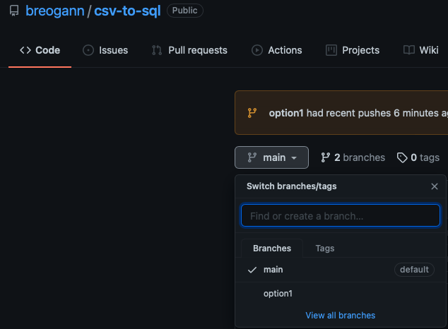

# csv-to-sql

Hey there! 🙋‍♂️

Welcome to my project. As you know, there were two possible options: **option 1** & **option 2**. 

To see either of them (in this case, only the first one), you can go up to the branches section of the repo and select `option1`. 

There you will see the content. Thank you for stopping by! 

