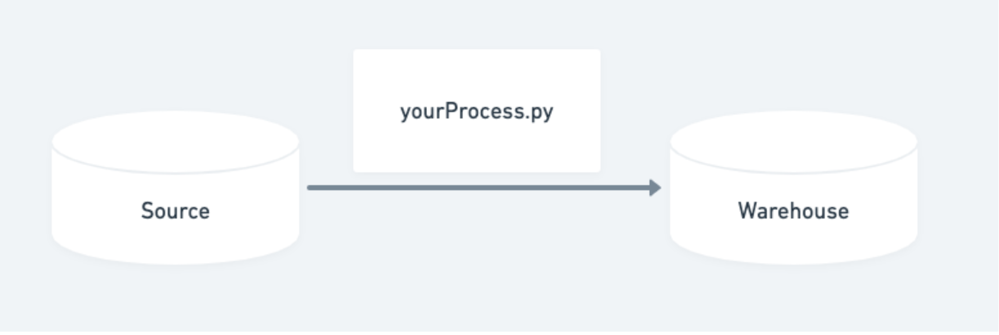

# Option 1 - Transfering data from a DataFrame into a SQL database



This script will get a CSV file (in this case, in the input directory) and will get the information, clean it and transfer it into a SQL Database. Then, that very same information will be queried again to check the result.

The columns that are inserted & queried can be selected through the command line. 

# 0. Clone

```bash
git clone https://github.com/breogann/csv-to-sql.git
cd csv-to-sql
git checkout option1
````
# 1. Set up with conda
Choose only one of the following options:
### 1.1. Using YML
```bash
conda env update -n csv-to-sql --file environment.yml
conda activate csv-to-sql
```
### 1.2. Using pip

```bash
conda create --name csv-to-sql
conda activate csv-to-sql
conda install -n csv-to-sql pip
pip install -r requirements.txt
conda list -n csv-to-sql
```
# 2. Env variables

You will need to establish a connection with your SQL server. For that, you need to create a `.env` file and include your password:

```bash
echo password='"your_password"' >> .env
``` 
# 3. Using the command line

You're now all set to try it. [Here](https://whimsical.com/csv-to-sql-4Cg4d2QF4jhMfiYJ8Do9Cv) is a view of the workflow that the project follows:


When running the main.py, you can make use of the following argparse:

```bash
#Required

--path #of the initial csv
--database #where you want to input your table
--table #name of the table you want to insert

#Non-required

--columns #of the csv you want to select
--sqlcolumns #you want to retrieve
```

An example would be:
```bash
python3 main.py --path input/source_students.csv --columns --database students --table warehouse_students
```

The `--columns` option, when not used will select all of the columns from the inital csv. If called, it will show the user the columns and ask them to input them by comma separated numbers.

The `--sqlcolumns` option when ignored, will select all of the columns from the SQL table. When called, will force the new columns.

# Technologies used
- os
- [numpy](https://pypi.org/project/numpy/)
- [pandas](https://pypi.org/project/pandas/)
- [dotenv](https://pypi.org/project/dotenv/)
- [argparse](https://pypi.org/project/argparse/)
- [sqlalchemy](https://pypi.org/project/SQLAlchemy/)


# TO-DO 🔧
##### Code-wise:
- Classes oriented approach
- Refactoring: especially parametrization of SQL queries
- Generalizing the code for tailored queries (e.g.: sub-sets of tables)
##### Feature-wise:
- Automation for downloading Google spreadsheet into a CSV
- Deployment of scripts & SQL database
