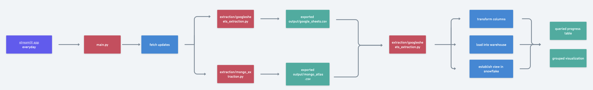

# Pipeline: google sheets & MongoAtlas into Snowflake warehouse

This application will fetch a table and a non-relational database and will get the information, clean it and transfer it into a snowflake warehouse. Then, that very same information will be queried from a view and visualized.


You can either:

- Use the [deployed version](https://breogann-csv-to-sql-main-case-study-h5c9cy.streamlitapp.com/)
- Use locally (mongoatlas & snowflake set up necessary)

# 0. Locally

```bash
git clone https://github.com/breogann/csv-to-sql/tree/case-study
cd csv-to-sql
git checkout case-study
```

# 1. Set up with conda

Choose only one of the following options:

### 1.1. Using YML

```bash
conda env update -n csv-to-sql --file environment.yml
conda activate csv-to-sql
```

### 1.2. Using pip

```bash
conda create --name csv-to-sql
conda activate csv-to-sql
conda install -n csv-to-sql pip
pip install -r requirements.txt
conda list -n csv-to-sql
```

# 2. Env variables

You will need to establish a connection with your mongoatlas & snowflake server. For that, you need to create a `.env` file and include your passwords.

```bash
echo SNOWFLAKE_USER='"your_password"' >> .env
echo SNOWFLAKE_PASSWORD='"your_password"' >> .env
echo SNOWFLAKE_ACCOUNT='"your_password"' >> .env
echo MONGO_CONNECTION_STRING='"your_password"' >> .env
```

# 3. Workflow

You're now all set to try it. [Here](https://whimsical.com/snowflake-R7DsKdgPEFNQJ37HwWB2Yx) is a view of the workflow that the project follows:



# Technologies used

- [gsheetsdb](https://pypi.org/project/gsheetsdb/)
- [pandas](https://pandas.pydata.org/docs/index.html)
- [pillow](https://pillow.readthedocs.io/en/stable/)
- [pymongo](https://pymongo.readthedocs.io/en/stable/)
- [snowflake](https://docs.snowflake.com/en/)
- [sqlalchemy](https://docs.sqlalchemy.org/en/14/core/functions.html)
- [sreamlit](https://docs.streamlit.io/)
- [plotly](https://plotly.com/python/plotly-express/)

# TO-DO

- Classes oriented approach
- Refactoring: parametrization of SQL queries
- Cover corner cases through error handling
- Test driven development
